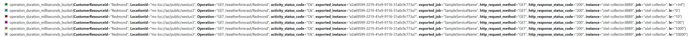
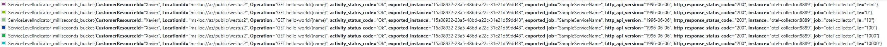

# Service Level Indicators

[](https://github.com/xavierjohn/ServiceLevelIndicators/actions/workflows/build.yml)
[](https://opensource.org/licenses/MIT)

ServiceLevelIndicators is a .NET library for emitting service-level latency metrics in milliseconds using the standard [System.Diagnostics.Metrics](https://learn.microsoft.com/dotnet/api/system.diagnostics.metrics) and OpenTelemetry pipeline.

It is designed for teams that need more than generic request timing. The library helps measure meaningful operations, attach service-specific dimensions such as customer, location, operation name, and status, and build SLO or SLA-oriented dashboards and alerts from those metrics.

Service level indicators (SLIs) are metrics used to track how a service is performing against expected reliability and responsiveness goals. Common examples include availability, response time, throughput, and error rate. This library focuses on latency SLIs so you can consistently measure operation duration across background work, ASP.NET Core APIs, and versioned endpoints.

[](https://www.youtube.com/embed/wXJbA0AkcRE)


## Service Level Indicator Library

**Trellis.ServiceLevelIndicators** emits operation latency metrics in milliseconds so service owners can monitor performance over time using dimensions that matter to their system.
The metrics are emitted via the standard [.NET Meter Class](https://learn.microsoft.com/en-us/dotnet/api/system.diagnostics.metrics.meter).

By default, a meter named `Trellis.SLI` with instrument name `operation.duration` is added to the service metrics. The metrics are emitted with the following [attributes](https://opentelemetry.io/docs/specs/otel/common/#attribute).

- CustomerResourceId - The **target resource** of the operation — the noun in the URL path being read or modified, normalized to a stable identifier (tenant, subscription, account, work item). **NOT** the caller, **NOT** a per-request GUID, **NOT** a user ID or email. Example: for `GET /teams/{teamId}` called by user `xa1` for team `team1`, the value is `"team1"`, not `"xa1"`. See the [ASP.NET Core package README](Trellis.ServiceLevelIndicators.Asp/src/README.md#what-customerresourceid-is--and-what-it-is-not) for the full mental model.
- LocationId - The location where the service running. eg. Public cloud, West US 3 region. [Azure Core](https://learn.microsoft.com/en-us/dotnet/api/azure.core.azurelocation?view=azure-dotnet)
- Operation - The name of the operation.
- activity.status.code - The activity status code is set based on the success or failure of the operation. [ActivityStatusCode](https://learn.microsoft.com/en-us/dotnet/api/system.diagnostics.activitystatuscode).

**Trellis.ServiceLevelIndicators.Asp** adds the following dimensions.

- Operation - For ASP.NET endpoints, the operation name is the HTTP method plus the route template, resolved in this order: (1) `[ServiceLevelIndicator(Operation = "...")]` attribute or `.AddServiceLevelIndicator("op")` override, (2) MVC `AttributeRouteInfo.Template`, (3) the endpoint's `RouteEndpoint.RoutePattern.RawText` (Minimal APIs / conventional routing). Route placeholders such as `{id}` are preserved, never substituted with the concrete request value. If no bounded template is available, the middleware emits the sentinel `"<METHOD> <unrouted>"` and logs a warning — see that value in your metrics as a signal to add a route template.
- The activity status code will be
   "Ok" when the http response status code is in the 2xx range,
   "Error" when the http response status code is in the 5xx range,
   "Unset" for any other status code.
- http.response.status.code - The http status code.
- http.request.method (Optional)- The http request method (GET, POST, etc) is added.

Difference between ServiceLevelIndicator and http.server.request.duration

|             | ServiceLevelIndicator | http.server.request.duration
| ----------  | ------- | ------
| Resolution  | milliseconds       | seconds
| Customer    | CustomerResourceId | N/A
| Error check | Activity or HTTP status.code | HTTP status code

This makes the library useful when generic HTTP server metrics are not enough, especially for multi-tenant services, APIs with customer-specific objectives, or workloads that need the same SLI model outside HTTP request handling.

**Trellis.ServiceLevelIndicators.Asp.ApiVersioning** adds the following dimensions.
- http.api.version - The API Version when used in conjunction with [API Versioning package](https://github.com/dotnet/aspnet-api-versioning).


## NuGet Packages

- **Trellis.ServiceLevelIndicators**

  This library can be used to emit SLI for all .net core applications, where each operation is measured.

  [](https://www.nuget.org/packages/Trellis.ServiceLevelIndicators)

- **Trellis.ServiceLevelIndicators.Asp**

  For measuring SLI for ASP.NET Core applications use this library that will automatically measure each API operation.

  [](https://www.nuget.org/packages/Trellis.ServiceLevelIndicators.Asp)
  
- **Trellis.ServiceLevelIndicators.Asp.ApiVersioning**

  If [API Versioning package](https://github.com/dotnet/aspnet-api-versioning) is used, this library will add the API version as a metric dimension.

  [](https://www.nuget.org/packages/Trellis.ServiceLevelIndicators.Asp.ApiVersioning)

## Installation

```shell
dotnet add package Trellis.ServiceLevelIndicators
```

For a concise package-selection and integration guide, see [docs/usage-reference.md](docs/usage-reference.md).

API references:

- [`docs/api_reference/trellis-api-sli.md`](docs/api_reference/trellis-api-sli.md) — `Trellis.ServiceLevelIndicators` (core)
- [`docs/api_reference/trellis-api-sli-asp.md`](docs/api_reference/trellis-api-sli-asp.md) — `Trellis.ServiceLevelIndicators.Asp` (middleware + attributes)
- [`docs/api_reference/trellis-api-sli-apiversioning.md`](docs/api_reference/trellis-api-sli-apiversioning.md) — `Trellis.ServiceLevelIndicators.Asp.ApiVersioning`

For ASP.NET Core:

```shell
dotnet add package Trellis.ServiceLevelIndicators.Asp
```

For API Versioning support:

```shell
dotnet add package Trellis.ServiceLevelIndicators.Asp.ApiVersioning
```

## Usage for ASP.NET Core MVC

1. Register SLI with open telemetry by calling `AddServiceLevelIndicatorInstrumentation`.

   Example:

    ```csharp
    builder.Services.AddOpenTelemetry()
        .ConfigureResource(configureResource)
        .WithMetrics(builder =>
        {
            builder.AddServiceLevelIndicatorInstrumentation();
            builder.AddOtlpExporter();
        });
    ```

   If you configure `ServiceLevelIndicatorOptions.Meter` with a custom meter, register that same meter with OpenTelemetry:

    ```csharp
    var sliMeter = new Meter("MyCompany.ServiceLevelIndicator");

    builder.Services.AddOpenTelemetry()
        .ConfigureResource(configureResource)
        .WithMetrics(metrics =>
        {
            metrics.AddServiceLevelIndicatorInstrumentation(sliMeter);
            metrics.AddOtlpExporter();
        });

    builder.Services.AddServiceLevelIndicator(options =>
    {
        options.Meter = sliMeter;
        options.LocationId = ServiceLevelIndicator.CreateLocationId("public", AzureLocation.WestUS3.Name);
    });
    ```

2. Add ServiceLevelIndicator into the dependency injection. `AddMvc()` is required for overrides present in MVC SLI attributes to take effect.

   Example:

    ```csharp
    builder.Services.AddServiceLevelIndicator(options =>
    {
        options.LocationId = ServiceLevelIndicator.CreateLocationId("public", AzureLocation.WestUS3.Name);
    })
    .AddMvc();
    ```

3. Add the middleware to the pipeline.

    ```csharp
    app.UseServiceLevelIndicator();
    ```

## Usage for Minimal APIs

1. Register SLI with open telemetry by calling `AddServiceLevelIndicatorInstrumentation`.

   Example:

    ```csharp
    builder.Services.AddOpenTelemetry()
        .ConfigureResource(configureResource)
        .WithMetrics(builder =>
        {
            builder.AddServiceLevelIndicatorInstrumentation();
            builder.AddOtlpExporter();
        });
    ```

2. Add ServiceLevelIndicator into the dependency injection. By default, SLI is emitted for every routed endpoint when the middleware is present. Set `AutomaticallyEmitted = false` if you want Minimal APIs to opt in endpoint-by-endpoint with `.AddServiceLevelIndicator()`.

   Example:

    ```csharp
    builder.Services.AddServiceLevelIndicator(options =>
    {
        options.LocationId = ServiceLevelIndicator.CreateLocationId("public", AzureLocation.WestUS3.Name);
    });
    ```

3. Add the middleware to the ASP.NET Core pipeline.

   Example:

    ```csharp
    app.UseServiceLevelIndicator();
    ```

4. Optional: when `AutomaticallyEmitted = false`, add `AddServiceLevelIndicator()` to each route mapping that should emit SLI metrics.

   Example:

    ```csharp
    app.MapGet("/hello", () => "Hello World!")
       .AddServiceLevelIndicator();
    ```

## Usage for Background Jobs

You can measure a block of code by wrapping it in a `using` clause of `MeasuredOperation`.

Example:

```csharp
async Task MeasureCodeBlock(ServiceLevelIndicator serviceLevelIndicator)
{
    using var measuredOperation = serviceLevelIndicator.StartMeasuring("OperationName");
    // Do Work.
    measuredOperation.SetActivityStatusCode(System.Diagnostics.ActivityStatusCode.Ok);
}
```

## Operational Guidance

### Cardinality Guidance

All three required tags — `Operation`, `LocationId`, and `CustomerResourceId` — must be **low-cardinality and bounded**. The library bounds `Operation` for you via the route-template resolver and the `<unrouted>` sentinel; you are responsible for `LocationId` (set once from configuration) and `CustomerResourceId` (stable tenant / subscription / resource identifier).

The same discipline applies to `[Measure]` parameters and any custom attributes added via `AddAttribute(...)`. Avoid email addresses, request IDs, timestamps, or unconstrained free text unless your metrics backend is explicitly designed for high-cardinality telemetry.

### Disposal

`ServiceLevelIndicator` is a sealed `IDisposable` registered as a singleton; the DI container disposes it (and the `Meter` it created) at host shutdown — no manual cleanup needed. A `Meter` you supply via `ServiceLevelIndicatorOptions.Meter` is owned by you and is never disposed by SLI.

## ASP.NET Core Customizations

Once the Prerequisites are done, all controllers will emit SLI information.
The default operation name is the HTTP method plus the route template (placeholders such as `{id}` are preserved). The full resolution order is described under **Trellis.ServiceLevelIndicators.Asp** above.

- To add API versioning as a dimension use package `Trellis.ServiceLevelIndicators.Asp.ApiVersioning` and enrich the metrics with `AddApiVersion`.

   Example:

    ```csharp
    builder.Services.AddServiceLevelIndicator(options =>
    {
        /// Options
    })
    .AddMvc()
    .AddApiVersion();
    ```

- To add HTTP method as a dimension, add `AddHttpMethod` to Service Level Indicator.

   Example:

    ```csharp
    builder.Services.AddServiceLevelIndicator(options =>
    {
        /// Options
    })
    .AddMvc()
    .AddHttpMethod();
    ```

- Enrich SLI with the `Enrich` callback. The callback receives a `MeasuredOperation` as context that can be used to set `CustomerResourceId` or additional attributes.
  An async version `EnrichAsync` is also available.

   Example:

    ```csharp
    builder.Services.AddServiceLevelIndicator(options =>
    {
        options.LocationId = ServiceLevelIndicator.CreateLocationId(Cloud, Region);
    })
    .AddMvc()
    .Enrich(context =>
    {
        // Pull a STABLE tenant/subscription identifier — NOT the caller's UPN/user ID.
        var tenantId = context.HttpContext.User.Claims
            .FirstOrDefault(c => c.Type == "tid")?.Value ?? "unknown";
        context.SetCustomerResourceId(tenantId);

        // Caller identity belongs in a separate (still bounded) dimension, not in CustomerResourceId.
        var tier = context.HttpContext.User.Claims
            .FirstOrDefault(c => c.Type == "tier")?.Value ?? "free";
        context.AddAttribute("CallerTier", tier);
    });
    ```

- To override the default operation name, add the attribute `[ServiceLevelIndicator]` and specify the operation name.

   Example:

    ```csharp
    [HttpGet("MyAction2")]
    [ServiceLevelIndicator(Operation = "MyNewOperationName")]
    public IEnumerable<WeatherForecast> GetOperation() => GetWeather();
    ```

- To set the `CustomerResourceId` within an API method, mark the parameter with the attribute `[CustomerResourceId]`

    ```csharp
    [HttpGet("teams/{teamId}")]
    public IEnumerable<WeatherForecast> GetByTeam([CustomerResourceId] string teamId)
       => GetWeather();
    ```

    Or use `GetMeasuredOperation` extension method.

    ``` csharp
    [HttpGet("{customerResourceId}")]
    public IEnumerable<WeatherForecast> Get(string customerResourceId)
    {
        HttpContext.GetMeasuredOperation().CustomerResourceId = customerResourceId;
        return GetWeather();
    }
    ```

- To add custom Open Telemetry attributes.  

    ``` csharp
    HttpContext.GetMeasuredOperation().AddAttribute(attribute, value);
    ```

    GetMeasuredOperation will **throw** if the route is not configured to emit SLI.

    When used in a middleware or scenarios where a route may not be configured to emit SLI.

    ``` csharp
    if (HttpContext.TryGetMeasuredOperation(out var measuredOperation))
        measuredOperation.AddAttribute("CustomAttribute", value);
    ```

    You can add additional dimensions to the SLI data by using the `Measure` attribute. Parameters decorated with `[Measure]` are automatically added as metric attributes (dimensions) using the parameter name as the attribute key.

    ```csharp
    [HttpGet("name/{first}/{surname}")]
    public IActionResult GetCustomerResourceId(
        [Measure] string first,
        [CustomerResourceId] string surname)
          => Ok(first + " " + surname);
    ```

- To prevent automatically emitting SLI information on all controllers, set the option,

    ``` csharp
    builder.Services.AddServiceLevelIndicator(options =>
    {
        options.AutomaticallyEmitted = false;
    })
    .AddMvc();
    ```

    In this case, add the attribute `[ServiceLevelIndicator]` on the controllers that should emit SLI.

## Sample

Try out the sample weather forecast Web API.

To view the metrics locally using the [.NET Aspire Dashboard](https://aspire.dev/dashboard/standalone/):

1. Start the Aspire dashboard:
   ```
   docker run --rm -it -d -p 18888:18888 -p 4317:18889 -e DOTNET_DASHBOARD_UNSECURED_ALLOW_ANONYMOUS=true -e DASHBOARD__OTLP__AUTHMODE=Unsecured --name aspire-dashboard mcr.microsoft.com/dotnet/aspire-dashboard:latest
   ```
2. Run the sample web API project and call the `GET WeatherForecast` using the Open API UI.
3. Open `http://localhost:18888` to view the dashboard. You should see the SLI metrics under the instrument `operation.duration` where `Operation = "GET WeatherForecast"`, `http.response.status.code = 200`, `LocationId = "ms-loc://az/public/westus2"`, `activity.status.code = Ok`.

4. If you run the sample with API Versioning, you will see something similar to the following.

