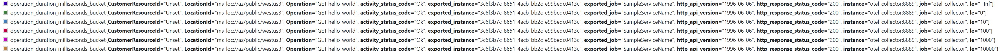

# Service Level Indicators

Service level indicators (SLIs) are metrics used to measure the performance of a service.
They are typically used in the context of service level agreements (SLAs),
which are contracts between a service provider and its customers that define the expected level of service.
SLIs are used to track the actual performance of the service against the agreed upon SLA.

There are many different types of SLIs that can be used to measure the performance of a service. Some common examples include:

- Availability: This measures the percentage of time that a service is available and functioning properly.
- Response time: This measures the amount of time it takes for a service to respond to a request.
- Throughput: This measures the amount of work that a service can handle in a given period of time.
- Error rate: This measures the percentage of requests that result in errors.

SLIs are important because they provide a way to objectively measure the performance of a service.
By tracking SLIs over time, service providers can identify trends and make improvements to the service to ensure that it meets the needs of its customers.

[](https://www.youtube.com/embed/wXJbA0AkcRE)


## Service Level Indicator Library

**ServiceLevelIndicators** library will help emit latency metrics for each API operation to help monitor the service performance over time.
The metrics is emitted via standard [.NET Meter Class](https://learn.microsoft.com/en-us/dotnet/api/system.diagnostics.metrics.meter?view=net-7.0).

By default, an instrument named `ServiceLevelIndicator` is added to the service metrics and the metrics are emitted. The metrics are emitted with the following [attributes](https://opentelemetry.io/docs/specs/otel/common/#attribute).

- CustomerResourceId - A value that helps identity the customer, customer group or calling service.
- LocationId - The location where the service running. eg. Public cloud, West US 3 region.
- Operation - The name of the operation.
- activity.status.code - The activity status code is set based on the success or failure of the operation. [ActivityStatusCode](https://learn.microsoft.com/en-us/dotnet/api/system.diagnostics.activitystatuscode?view=net-7.0).

**ServiceLevelIndicators.Asp** adds the following dimensions.

- Operation - In ASP.NET the operation name defaults to `AttributeRouteInfo.Template` information like `GET Weatherforecast`.
- The activity status code will be
   "Ok" when the http response status code is in the 2xx range,
   "Error" when the http response status code is in the 5xx range,
   "Unset" for any other status code.
- http.response.status_code - The http status code.
- http.request.method (Optional)- The http request method (GET, POST, etc) is added.

Difference between ServiceLevelIndicator and http.server.request.duration

|             | ServiceLevelIndicator | http.server.request.duration
| ----------  | ------- | ------
| Resolution  | milliseconds       | seconds
| Customer    | CustomerResourceId | N/A
| Error check | Activity or HTTP status.code | HTTP status code

**ServiceLevelIndicators.Asp.Versioning** adds the following dimensions.
- http.api.version - The API Version when used in conjunction with [API Versioning package](https://github.com/dotnet/aspnet-api-versioning).


## NuGet Packages

- **ServiceLevelIndicators**

  This library can be used to emit SLI for all .net core applications, where each operation is measured.

  [](https://www.nuget.org/packages/ServiceLevelIndicators)

- **ServiceLevelIndicators.Asp**

  For measuring SLI for ASP.NET Core applications use this library that will automatically measure each API operation.

  [](https://www.nuget.org/packages/ServiceLevelIndicators.Asp)
  
- **ServiceLevelIndicators.Asp.ApiVersioning**

  If [API Versioning package](https://github.com/dotnet/aspnet-api-versioning) is used, this library will add the API version as a metric dimension.

  [](https://www.nuget.org/packages/ServiceLevelIndicators.Asp.ApiVersioning)

## Usage for Web API MVC

1. Create and register a metrics meter with the dependency injection.

   Example.

    ``` csharp

    public class SampleApiMeters
    {
        public const string MeterName = "SampleMeter";
        public Meter Meter { get; } = new Meter(MeterName);
    }
    builder.Services.AddSingleton<SampleApiMeters>();
    
    ```

2. Add a class to configure SLI

    Example.

    ```csharp

    internal sealed class ConfigureServiceLevelIndicatorOptions
        : IConfigureOptions<ServiceLevelIndicatorOptions>
    {
        public ConfigureServiceLevelIndicatorOptions(SampleApiMeters meters)
            => this.meters = meters;
        public void Configure(ServiceLevelIndicatorOptions options)
            => options.Meter = meters.Meter;

        private readonly SampleApiMeters meters;
    }

    builder.Services.TryAddEnumerable(
        ServiceDescriptor.Singleton<IConfigureOptions<ServiceLevelIndicatorOptions>,
        ConfigureServiceLevelIndicatorOptions>());

    ```

3. Add ServiceLevelIndicator, into the dependency injection. AddMvc() is required for overrides present in SLI attributes to take effect.

   Example.

    ``` csharp

    builder.Services.AddServiceLevelIndicator(options =>
    {
        options.LocationId = ServiceLevelIndicator.CreateLocationId("public", "westus2");
    })
    .AddMvc();

    ```

4. Add the middleware to the pipeline.

    ``` csharp

    app.UseServiceLevelIndicator();

    ```

## Usage for Minimal API

1. Create the metrics meter.

    Example.

    ```csharp

    internal sealed class Sample
    {
        public static Meter Meter { get; } = new(nameof(Sample));
    }

    ```

2. Add ServiceLevelIndicator into the dependency injection.

   Example.

    ``` csharp

    builder.Services.AddServiceLevelIndicator(options =>
    {
        options.LocationId = ServiceLevelIndicator.CreateLocationId("public", "westus2");
    });

    ```

3. Add the middleware to the ASP.NET core pipeline.

   Example.

    ``` csharp

    app.UseServiceLevelIndicator();
    
    ```

4. To each API route mapping, add `AddServiceLevelIndicator()`

   Example.

    ``` csharp

    app.MapGet("/hello", () => "Hello World!")
       .AddServiceLevelIndicator();
    
    ```

### Usage for background jobs

You can measure a block of code by boxing it in a using clause of MeasuredOperation.
Example.

```csharp

async Task MeasureCodeBlock(ServiceLevelIndicator serviceLevelIndicator)
{
    using var measuredOperation = serviceLevelIndicator.StartMeasuring("OperationName");
    // Do Work.
    measuredOperation.SetActivityStatusCode(System.Diagnostics.ActivityStatusCode.Ok);
}

```

### Customizations

Once the Prerequisites are done, all controllers will emit SLI information.
The default operation name is in the format &lt;HTTP Method&gt; &lt;Controller&gt;/&lt;Action&gt;.
eg GET WeatherForecast/Action1

- To add API versioning as a dimension use package `ServiceLevelIndicators.Asp.ApiVersioning` and enrich the metrics with `AddApiVersion`.

   Example.

    ``` csharp

    builder.Services.AddServiceLevelIndicator(options =>
    {
        /// Options
    })
    .AddMvc()
    .AddApiVersion();

    ```

- To add HTTP method as a dimension, add `AddHttpMethod` to Service Level Indicator.

   Example.

    ``` csharp

    builder.Services.AddServiceLevelIndicator(options =>
    {
        /// Options
    })
    .AddMvc()
    .AddHttpMethod();

    ```

- Enrich SLI with `Enrich` callback. The callback receives a `MeasuredOperation` as context that can be used to set to `CustomerResourceId` or additional attributes.
An async version `EnrichAsync` is also available.

   Example.

    ``` csharp

    builder.Services.AddServiceLevelIndicator(options =>
    {
        options.LocationId = ServiceLevelIndicator.CreateLocationId(Cloud, Region);
    })
    .AddMvc()
    .Enrich(context =>
    {
        var upn = context.HttpContext.User.Claims
            .FirstOrDefault(c => c.Type == "upn")?.Value ?? "Unknown";
        context.SetCustomerResourceId(upn);
    });

    ```

- To override the default operation name add the attribute `[ServiceLevelIndicator]` and specify the operation name.

   Example.

    ``` csharp

    [HttpGet("MyAction2")]
    [ServiceLevelIndicator(Operation = "MyNewOperationName")]
    public IEnumerable<WeatherForecast> GetOperation() => GetWeather();

    ```

- To set the `CustomerResourceId` within an API method, mark the parameter with the attribute `[CustomerResourceId]`

    ```csharp

    [HttpGet("get-by-zip-code/{zipCode}")]
    public IEnumerable<WeatherForecast> GetByZipcode([CustomerResourceId] string zipCode)
       => GetWeather();

    ```

    Or use `GetMeasuredOperation` extension method.

    ``` csharp

    [HttpGet("{customerResourceId}")]
    public IEnumerable<WeatherForecast> Get(string customerResourceId)
    {
        HttpContext.GetMeasuredOperation().CustomerResourceId = customerResourceId;
        return GetWeather();
    }

    ```

- To add custom Open Telemetry attributes.  

    ``` csharp

    HttpContext.GetMeasuredOperation().AddAttribute(attribute, value);

    ```

    GetMeasuredOperation will **throw** if the route is not configured to emit SLI.

    When used in a middleware or scenarios where a route may not be configured to emit SLI.

    ``` csharp

    if (HttpContext.TryGetMeasuredOperation(out var measuredOperation))
        measuredOperation.AddAttribute("CustomAttribute", value);

    ```

    You can add additional dimensions to the SLI data by using the `Measure` attribute.

    ```csharp

    [HttpGet("name/{first}/{surname}")]
    public IActionResult GetCustomerResourceId(
        [Measure] string first,
        [CustomerResourceId] string surname)
          => Ok(first + " " + surname);

    ```

- To prevent automatically emitting SLI information on all controllers, set the option,

    ``` csharp

    ServiceLevelIndicatorOptions.AutomaticallyEmitted = false;

    ```

    In this case, add the attribute `[ServiceLevelIndicator]` on the controllers that should emit SLI.

- To measure a process, run it within a `using StartMeasuring` block.

   Example.

    ``` csharp

   public void StoreItem(MyDomainEvent domainEvent)
   {
        var attribute = new KeyValuePair<string, object?>("Event", domainEvent.GetType().Name);
        using var measuredOperation = _serviceLevelIndicator.StartMeasuring("StoreItem", attribute);
        DoTheWork();
   )

   ```

### Sample

Try out the sample weather forecast Web API.

To view the metrics locally.

1. Run Docker Desktop
2. Run [sample\DockerOpenTelemetry\run.cmd](sample\DockerOpenTelemetry\run.cmd) to download and run zipkin and prometheus.
3. Run the sample web API project and call the `GET WeatherForecast` using the Open API UI.
4. You should see the SLI metrics in prometheus under the meter `ServiceLevelIndicator_bucket` where the `Operation = "GET WeatherForeCase"`, `http.response.status_code = 200`, `LocationId = "ms-loc://az/public/westus2"`, `activity.status_code = Ok`

5. If you run the sample with API Versioning, you will see something similar to the following.
