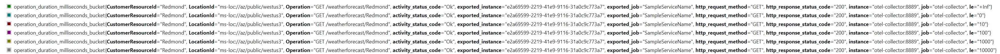

# Service Level Indicators
Service level indicators (SLIs) are metrics used to measure the performance of a service.
They are typically used in the context of service level agreements (SLAs),
which are contracts between a service provider and its customers that define the expected level of service.
SLIs are used to track the actual performance of the service against the agreed-upon SLA.

There are many different types of SLIs that can be used to measure the performance of a service. Some common examples include:

- Availability: This measures the percentage of time that a service is available and functioning properly.
- Response time: This measures the amount of time it takes for a service to respond to a request.
- Throughput: This measures the amount of work that a service can handle in a given period of time.
- Error rate: This measures the percentage of requests that result in errors.

SLIs are important because they provide a way to objectively measure the performance of a service.
By tracking SLIs over time, service providers can identify trends and make improvements to the service to ensure that it meets the needs of its customers.

## Service Level Indicator Library
Service Level Indicator library will help emit latency metrics for each API operation to help monitor the service performance over time.
The metrics is emitted via standard [.NET Meter Class](https://learn.microsoft.com/en-us/dotnet/api/system.diagnostics.metrics.meter?view=net-7.0).

By default, an instrument named `LatencySLI` is added to the service metrics and the metrics are emitted. The metrics are emitted with the following [attributes](https://opentelemetry.io/docs/specs/otel/common/#attribute).

* CustomerResourceId - The customer resource id.
* LocationId - The location id of where the service running. eg. Public cloud, West US 3 region.
* Operation - The name of the operation. Defaults to `AttributeRouteInfo.Template` information like `GET Weatherforecast`.
* HttpStatusCode - The http status code.
* api_version - If [API Versioning](https://github.com/dotnet/aspnet-api-versioning) is used, the version of the API.

## Usage


1. Create and register a metrics meter with the dependency injection.

   Example.

    ``` csharp
    public class SampleApiMeters
    {
        public const string MeterName = "SampleMeter";
        public Meter Meter { get; } = new Meter(MeterName);
    }
    builder.Services.AddSingleton<SampleApiMeters>();
    ```
    
2. Add a class to configure SLI

    Example.
    ```csharp
    internal sealed class ConfigureServiceLevelIndicatorOptions : IConfigureOptions<ServiceLevelIndicatorOptions>
    {
        private readonly SampleApiMeters meters;

        public ConfigureServiceLevelIndicatorOptions(SampleApiMeters meters) => this.meters = meters;

        public void Configure(ServiceLevelIndicatorOptions options) => options.Meter = meters.Meter;
    }

    builder.Services.TryAddEnumerable(ServiceDescriptor.Singleton<IConfigureOptions<ServiceLevelIndicatorOptions>, ConfigureServiceLevelIndicatorOptions>());
    ```

3. Add ServiceLevelIndicator into the dependency injection.

   Example.

    ``` csharp
    builder.Services.AddServiceLevelIndicator(options =>
    {
        Guid serviceTree = Guid.NewGuid();
        options.CustomerResourceId = ServiceLevelIndicator.CreateCustomerResourceId(serviceTree);
        options.LocationId = ServiceLevelIndicator.CreateLocationId("public", "westus2");
    });
    ```

4.  Add the middleware to the pipeline.
        
   If API versioning is used and want api_version as a SLI metric dimension, Use `app.UseServiceLevelIndicatorWithApiVersioning();`
   
   Otherwise, `app.UseServiceLevelIndicator();`
        

### Customizations

Once the Prerequisites are done, all controllers will emit SLI information.
The default operation name is in the format &lt;HTTP Method&gt; &lt;Controller&gt;/&lt;Action&gt;. 
eg GET WeatherForecast/Action1

* To override the default operation name add the attribute `[ServiceLevelIndicator]` and specify the operation name.

   Example.

    ``` csharp
    [HttpGet("MyAction2")]
    [ServiceLevelIndicator(Operation = "MyOperation")]
    public IEnumerable<WeatherForecast> GetOperation() => GetWeather();
    ```

* To override the `CustomerResourceId` within an API method, mark the parameter with the attribute `[CustomerResourceId]`
    ```csharp
        [HttpGet("get-by-zip-code/{zipCode}")]
        public IEnumerable<WeatherForecast> GetByZipcode([CustomerResourceId] string zipCode) => GetWeather();
    ```
 
    Or use `GetMeasuredOperationLatency` extension method.
        
    ``` csharp
    [HttpGet("{customerResourceId}")]
    public IEnumerable<WeatherForecast> Get(string customerResourceId)
    {
        HttpContext.GetMeasuredOperationLatency().CustomerResourceId = customerResourceId;
        return GetWeather();
    }
    ```

* To add custom Open Telemetry attributes.
    ``` csharp 
        HttpContext.GetMeasuredOperationLatency().AddAttribute(attribute, value);
    ```

* To prevent automatically emitting SLI information on all controllers, set the option.
    ``` csharp 
        ServiceLevelIndicatorOptions.AutomaticallyEmitted = false;
    ```
    In this case, add the attribute `[ServiceLevelIndicator]` on the controllers that should emit SLI.
    
* To measure a process, run it withing a `StartLatencyMeasureOperation` using block.

   Example.

    ``` csharp
   public void StoreItem(MyDomainEvent domainEvent)
    {
        var attribute = new KeyValuePair<string, object?>("Event", domainEvent.GetType().Name);
        using var measuredOperation = _serviceLevelIndicator.StartLatencyMeasureOperation("StoreItem", attribute);
        DoTheWork();
    ```

### Sample

Try out the sample weather forecast Web API.

To view the metrics locally.

1. Run Docker Desktop
2. Run [sample\DockerOpenTelemetry\run.cmd](sample\DockerOpenTelemetry\run.cmd) to download and run zipkin and prometheus.
3. Run the sample web API project and call the `GET WeatherForecast` using the Open API UI.
4. You should see the SLI metrics in prometheus under the meter `LatencySLI_bucket` where the `Operation = "GET WeatherForeCase"`, `HttpStatusCode = 200`, `LocationId = "public_West US 3"`, `Status = Ok`

5. If you run the sample with API Versioning, you will see something similar to the following.
