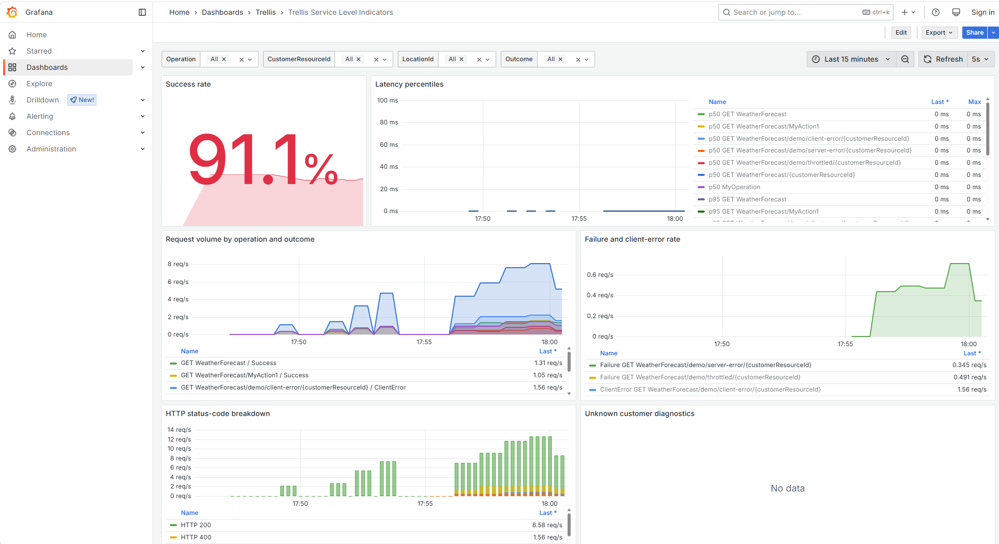

# Local SLI Grafana dashboard

This sample runs a local OpenTelemetry Collector, Prometheus, and Grafana stack so you can see the value of the SLI library while running one of the sample applications.

## Start the dashboard stack

From this directory:

```powershell
docker compose up -d
```

Grafana starts at http://localhost:3000 with anonymous admin access enabled for local development. The SLI dashboard is provisioned automatically under **Dashboards > Trellis > Service Level Indicators**.



## Run a sample app

In another terminal, run the Web API sample and point its OTLP exporter at the local collector:

```powershell
$env:OTEL_EXPORTER_OTLP_ENDPOINT = "http://localhost:4317"
dotnet run --project ..\..\WebApi\SampleWebApplicationSLI.csproj
```

Generate traffic:

```powershell
Invoke-RestMethod https://localhost:63936/WeatherForecast -SkipCertificateCheck
Invoke-RestMethod https://localhost:63936/WeatherForecast/MyAction1 -SkipCertificateCheck
Invoke-RestMethod https://localhost:63936/WeatherForecast/MyAction2 -SkipCertificateCheck
Invoke-RestMethod https://localhost:63936/WeatherForecast/my-customer-resource-id -SkipCertificateCheck
```

You can also run the Minimal API or API-versioned samples with the same `OTEL_EXPORTER_OTLP_ENDPOINT` environment variable.

## What the dashboard shows

The dashboard uses the SLI metric contract:

- `operation.duration` histogram exported to Prometheus as `operation_duration_milliseconds_*`
- `CustomerResourceId`
- `LocationId`
- `Operation`
- `Outcome`
- `http.request.method`
- `http.response.status.code`
- optional `http.api.version`

Panels include:

- request volume by operation and outcome
- p50/p95/p99 latency
- success rate using `Success / (Success + Failure)`
- failure and client-error rates
- HTTP status-code breakdown
- unknown customer diagnostics
- `<unrouted>` operation detection

## Stop the stack

```powershell
docker compose down
```
